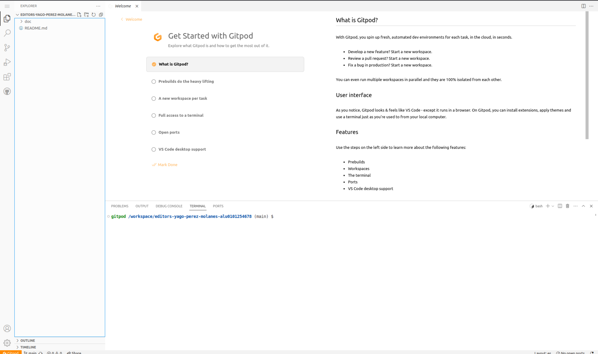

# Práctica Editors

Autor: Yago Pérez Molanes - alu0101254678

## Ítems de la rúbrica conseguidos

* GitPod: dado de alta e informe correcto

  * Me he dado de alta en GitPod, de forma que puedo acceder a él prefijando la URL que aparece en el navegador cuando se está en el repositorio con "gitpod.io/#", como se ve en la imagen.

  

  * Si introducimos la dirección de la imagen anterior, nos lleva a GitPod, presentando un entorno muy similar al de VSCode. En este caso, aparece vacío porque el repositorio está vacío en el momento de redactar este apartado.

  * El informe de cómo utilizar GitPod aparece en el apartado final de este README.md.

  

* Instalado botón gitpod en su browser

  * He instalado la extensión de Chrome que permite utilizar el botón de GitPod, como se ve en la imagen.

  

* Ha usado gitpod: Open in VSCode

  * Una vez abierto GitPod en el navegador, al seleccionar la opción "Open in VSCode" es posible abrir el GitPod en VSCode en la máquina local.

  

  * Por ejemplo, si creamos un archivo de prueba:

  

  * Los cambios se ven reflejados en la pestaña de GitPod en el navegador.

  

* Instalado SSH plugin para VSCode y funciona con máquina del iaas

  * Se ha instalado el plugin Remote-SSH.

  

* LiveShare instalado y funcionando correctamente

  

## Informe de cómo utilizar GitPod

* Se puede utilizar GitPod mediante las herramientas instaladas durante la realización de la práctica. Las diferentes posibilidades son:

  * Botón del navegador: después de abrir un repositorio, es posible pulsar el botón instalado gracias a la extensión de Chrome para abrir una pestaña del navegador que presenta una interfaz similar a VSCode.

  

  * VSCode: tras abrir GitPod con el botón del navegador, se puede clicar en "Open in VSCode" para abrir una ventana de VSCode en la que se puede editar el contenido del repositorio. Además, los cambios hechos en la pestaña del navegador se reflejan en la ventana de VSCode.

  

  * Botón del GitHub: también es posible clicar el botón "GitPod" que aparece en la pestaña "Code" del repositorio para abrir una pestaña del navegador con el entorno de GitPod.

  

## Experiencia adquirida en la práctica

* En esta práctica he aprendido principalmente las diferentes formas de acceder a GitPod, expuestas en el apartado anterior. Además he podido instalar el plugin de SSH y utilizarlo para conectarme a la máquina virtual y abrir el repositorio del proyecto con VSCode para editar los archivos cómodamente. Por último, he instalado también LiveShare en el VSCode de la máquina virtual para poder establecer sesiones cooperativas de trabajo con compañeros.